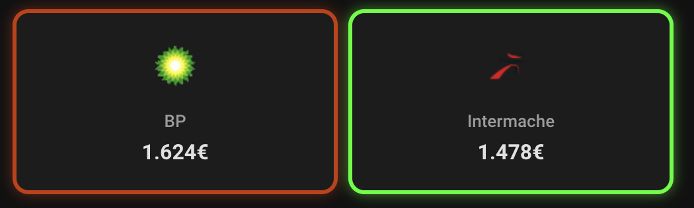

# Fuel Price Card

[](https://github.com/hacs/integration)
[](https://github.com/fcachado/fuel-price-card/stargazers)
[](https://github.com/fcachado/fuel-price-card/releases)
[](https://github.com/fcachado/fuel-price-card/releases)

A custom Lovelace card for Home Assistant that displays fuel prices with dynamic color coding.

|            Vertical Layout            |             Horizontal Layout             |
| :-----------------------------------: | :---------------------------------------: |
|  |  |

## Features

- 🎨 **Dynamic color coding** - Green (cheapest) → Yellow (middle) → Red (most expensive)
- 🖼️ **Automatic brand logos** - Uses `entity_picture` from sensors/device_trackers (no local files needed)
- 📱 **Two layouts** - Vertical (compact) or Horizontal (list view)
- 🔧 **Visual editor** - Configure via UI with entity picker, no YAML needed
- ⚡ **Lightweight** - No dependencies on other custom cards

## Installation

### HACS (Recommended)

Fuel Price Card is available in [HACS](https://hacs.xyz) (Home Assistant Community Store).

[](https://my.home-assistant.io/redirect/hacs_repository/?owner=fcachado&repository=fuel-price-card&category=plugin)

_or manually:_

1. Install HACS if you don't have it already
2. Open HACS in Home Assistant
3. Search for "Fuel Price Card"
4. Click "Download"
5. Reload your browser

### Manual

1. Download `fuel-price-card.js` from the [latest release](https://github.com/fcachado/fuel-price-card/releases)
2. Copy to `config/www/community/fuel-price-card/fuel-price-card.js`
3. Add to Lovelace resources:

```yaml
lovelace:
  resources:
    - url: /local/community/fuel-price-card/fuel-price-card.js
      type: module
```

## Usage

### Simple Configuration

```yaml
type: custom:fuel-price-card
entity: sensor.bp_aveiro_gasoleo_simples
min_entity: sensor.gasoleo_simples_min
max_entity: sensor.gasoleo_simples_max
```

### Full Configuration

```yaml
type: custom:fuel-price-card
entity: sensor.bp_aveiro_gasoleo_simples
name: BP Aveiro
min_entity: sensor.gasoleo_simples_min
max_entity: sensor.gasoleo_simples_max
layout: vertical
show_logo: true
show_color: true
```

## Options

| Option       | Type    | Default     | Description                              |
| ------------ | ------- | ----------- | ---------------------------------------- |
| `entity`     | string  | Required    | Fuel price sensor entity                 |
| `name`       | string  | Entity name | Display name (optional override)         |
| `min_entity` | string  | Required    | Sensor with minimum price for comparison |
| `max_entity` | string  | Required    | Sensor with maximum price for comparison |
| `layout`     | string  | `vertical`  | `vertical` or `horizontal`               |
| `show_logo`  | boolean | `true`      | Show brand logo from entity_picture      |
| `show_color` | boolean | `true`      | Show color indication (border/glow)      |

## Layouts

### Vertical Layout

Best for comparing multiple stations side by side in a compact grid.


```yaml
type: horizontal-stack
cards:
  - type: custom:fuel-price-card
    entity: sensor.bp_aveiro_gasoleo_simples
    min_entity: sensor.gasoleo_simples_min
    max_entity: sensor.gasoleo_simples_max
    layout: vertical

  - type: custom:fuel-price-card
    entity: sensor.shell_aguada_gasoleo_simples
    min_entity: sensor.gasoleo_simples_min
    max_entity: sensor.gasoleo_simples_max
    layout: vertical

  - type: custom:fuel-price-card
    entity: sensor.intermarche_gasoleo_simples
    min_entity: sensor.gasoleo_simples_min
    max_entity: sensor.gasoleo_simples_max
    layout: vertical
```

### Horizontal Layout

Best for detailed list view with logo, name, and price.


```yaml
type: vertical-stack
cards:
  - type: custom:fuel-price-card
    entity: sensor.bp_aveiro_gasoleo_simples
    min_entity: sensor.gasoleo_simples_min
    max_entity: sensor.gasoleo_simples_max
    layout: horizontal

  - type: custom:fuel-price-card
    entity: sensor.shell_aguada_gasoleo_simples
    min_entity: sensor.gasoleo_simples_min
    max_entity: sensor.gasoleo_simples_max
    layout: horizontal

  - type: custom:fuel-price-card
    entity: sensor.intermarche_gasoleo_simples
    min_entity: sensor.gasoleo_simples_min
    max_entity: sensor.gasoleo_simples_max
    layout: horizontal
```

## Brand Logos

The card automatically retrieves brand logos from:

1. **Sensor's `entity_picture`** attribute (if available)
2. **Device tracker's `entity_picture`** - looks for `device_tracker.*_location` associated with the sensor

If no logo is found, a generic gas station icon (⛽) is displayed.

> **Note**: When used with the [Preços Combustíveis](https://github.com/fcachado/ha-custom-component-precoscombustiveis) integration, logos are automatically provided by the device_tracker entities.

## Helper Sensors

This card requires min/max helper sensors for color comparison. Create them in your `templates.yaml`:

```yaml
template:
  - sensor:
      - name: "Gasóleo Simples Min"
        unique_id: gasoleo_simples_min
        unit_of_measurement: "€"
        state: >
          
          {{ sensors | min if sensors else 0 }}

      - name: "Gasóleo Simples Max"
        unique_id: gasoleo_simples_max
        unit_of_measurement: "€"
        state: >
          
          {{ sensors | max if sensors else 0 }}
```

## Color Coding

The card uses a gradient color system based on price comparison:

| Price Position | Color     | Meaning       |
| -------------- | --------- | ------------- |
| Cheapest       | 🟢 Green  | Best price    |
| Middle         | 🟡 Yellow | Average price |
| Most Expensive | 🔴 Red    | Highest price |

Set `show_color: false` to disable color indication.

## Visual Editor

The card includes a visual editor with entity pickers for easy configuration:

- Entity selector with autocomplete
- Min/Max entity selectors
- Layout dropdown
- Toggle switches for logo and color

## Contributing

Contributions are welcome! Please open an issue or submit a pull request.

## License

MIT License - see [LICENSE](LICENSE) for details.
